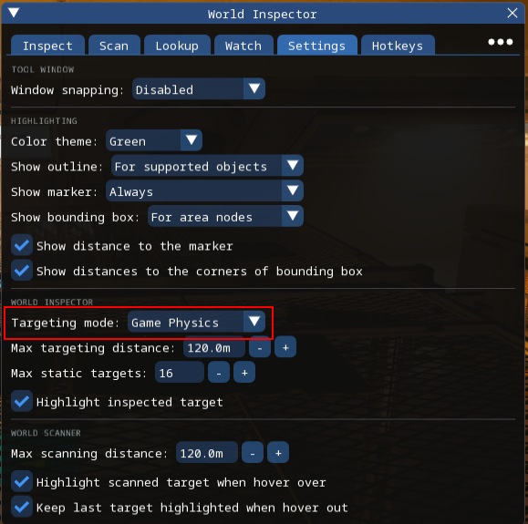
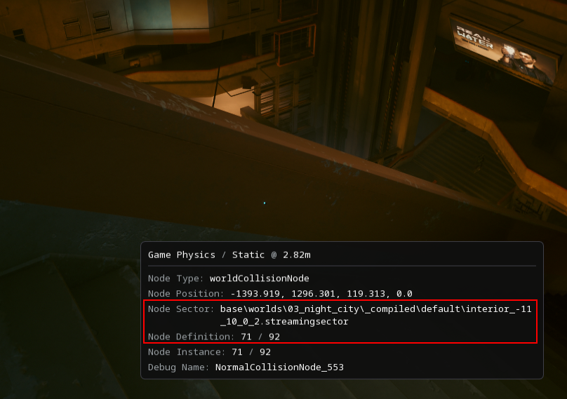
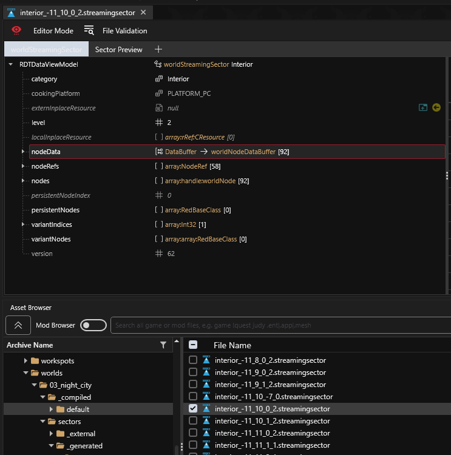
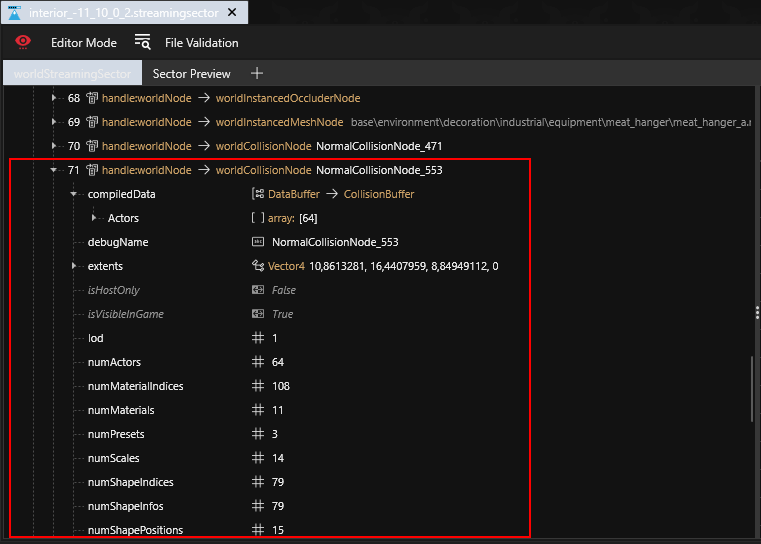
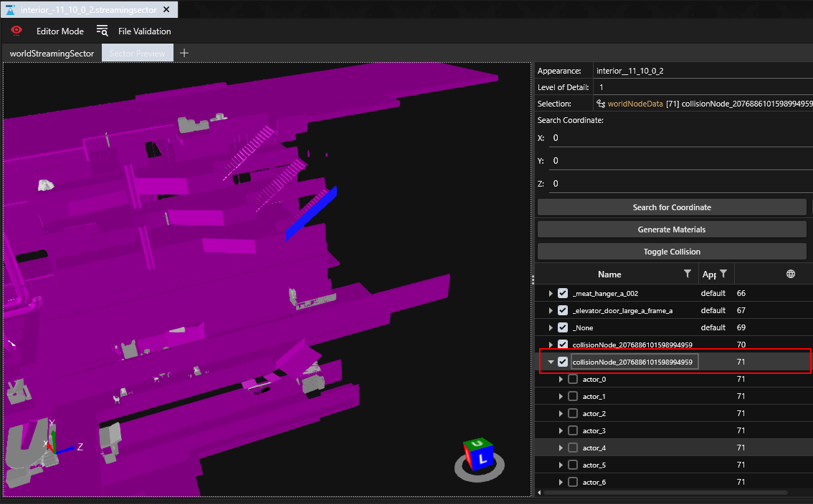
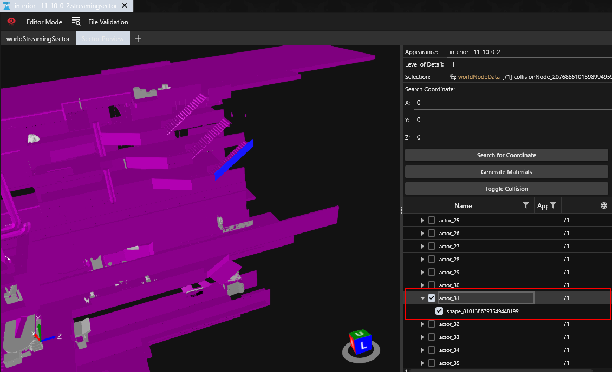
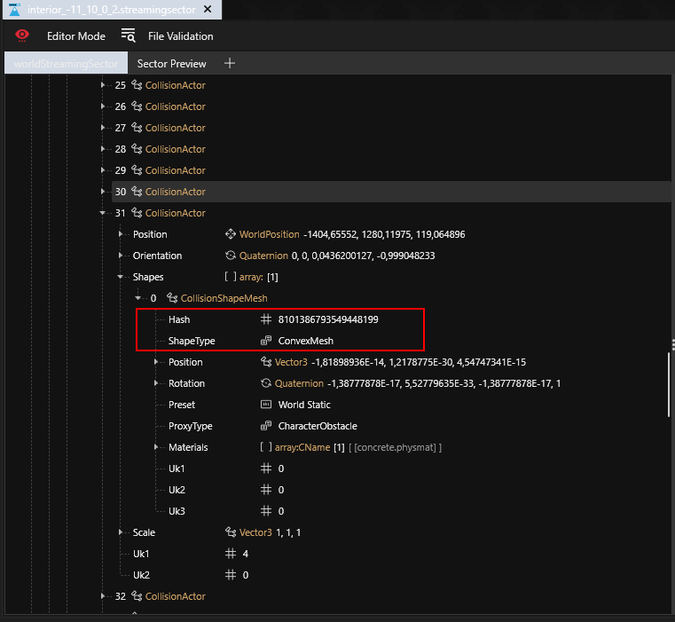
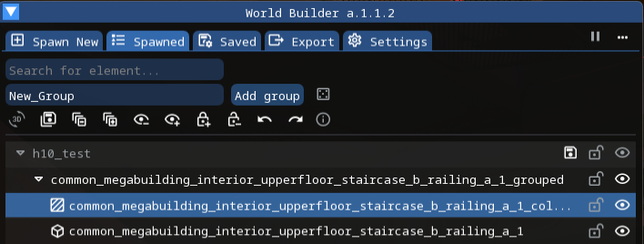

# Geometry-cache meshes for streaming-sector collision nodes

## Requirements

### Tools

- World Builder (with geometry-cache PhysX meshes feature)
- RedHotTools
- WolvenKit

## Steps

1. Resolve PhysX mesh identifiers in the geometry cache

   1.1. Enable **Game Physics** targeting mode in RedHotTools World Inspector.

   

   1.2. Target the desired object in-game. In World Inspector, note the streaming-sector file name and the node definition index within that sector.

   

   1.3. Find and open the streaming-sector file in WolvenKit.

   

   1.4. Find the node whose index matches step 1.2.

   

   1.5. Locate the `sectorHash` field on that node. You will enter this value into the World Builder collider **Sector Hash** parameter.

   

   1.6. Open the sector preview tab in WolvenKit and find the node with the index from step 1.2 in the nodes tree.

   

   1.7. Use the visibility toggle to find the tree entry (and its index in the name) for the actor that represents the collision of the targeted object.

   

   1.8. Return to the sector data tab. Under `compiledData` → `Actors`, open the actor whose index matches step 1.7. Expand **Shapes**, then the first item. The fields you need are `Hash` and `ShapeType`; use them for the World Builder collider parameters.

   

2. Create the collider in World Builder

   2.1. Spawn the desired mesh object and add a simple collider for it.

   **Important:** the mesh object and the collider must be in the same group at the same hierarchy level.

   

   2.2. Select the collider, enable **PhysX Mesh** (the PhysX Mesh Settings section appears), and expand it.

   **Important:** with PhysX Mesh enabled, the simple collider shown in-game is only for editing; it is not exported. The PhysX mesh is what gets exported.

   

   2.3. Set the parameters as follows:

   - **Target name:** name of the object you are attaching the collider to
   - **Sector hash:** value of the `sectorHash` field from step 1.5
   - **Actor Shape Hash:** value of the `Hash` field from step 1.8
   - **Actor Shape Type:** value of the `ShapeType` field from step 1.8

   
